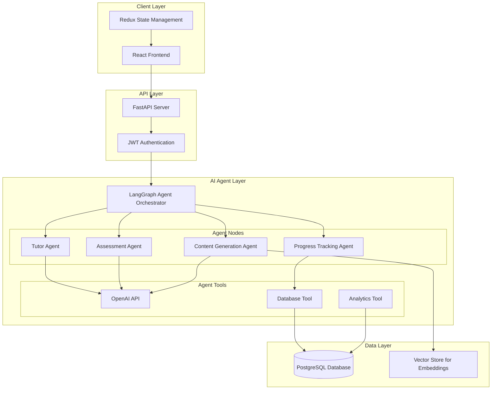
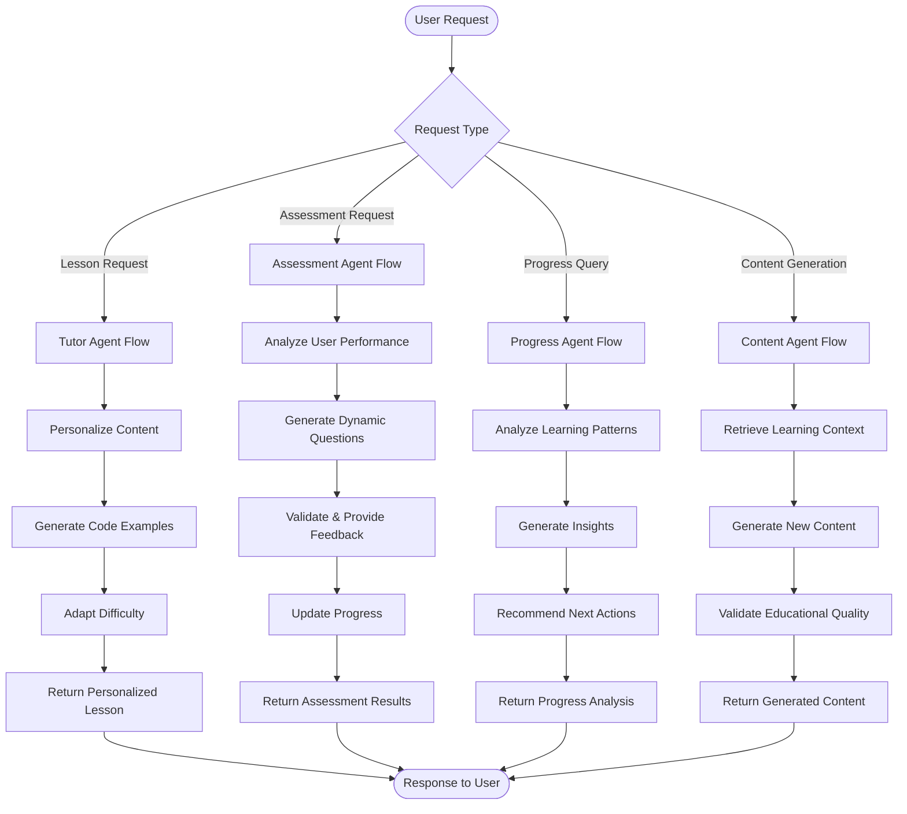

# Design Document

## Overview

ViperMind is designed as an intelligent Python tutoring platform powered by a LangGraph AI agent. The system consists of a React-based frontend for user interaction and a Python AI agent backend that uses OpenAI's API for intelligent content generation, personalized tutoring, and adaptive learning. The AI agent dynamically generates questions, provides personalized explanations, adapts curriculum difficulty, and creates code examples based on individual user performance. PostgreSQL serves as the persistence layer for user progress and curriculum structure.

## Architecture

### High-Level Architecture



### Technology Stack

**Frontend:**
- React 18 with TypeScript for type safety
- Redux Toolkit for state management
- React Router for navigation
- Tailwind CSS for responsive styling
- Axios for API communication

**AI Agent Backend:**
- Python 3.11+ with FastAPI for REST API
- LangGraph for agent orchestration and workflow management
- OpenAI API (GPT-4) for intelligent content generation
- LangChain for AI tool integration and prompt management
- Pydantic for data validation and serialization
- SQLAlchemy for database ORM
- PostgreSQL for primary data storage
- Chroma/FAISS for vector embeddings storage

**Development & Deployment:**
- Docker for containerization
- Pytest for Python testing
- Jest for frontend testing
- Black/Flake8 for Python code quality
- ESLint/Prettier for frontend code quality
- GitHub Actions for CI/CD

## LangGraph Agent Architecture

### Agent Workflow Design

The ViperMind AI agent uses LangGraph to orchestrate multiple specialized agents that work together to provide intelligent tutoring:



### Specialized Agent Nodes

#### 1. Tutor Agent
- **Purpose**: Provides personalized explanations and learning guidance
- **Capabilities**:
  - Adapts explanations based on user's current understanding level
  - Generates contextual hints when users struggle
  - Creates personalized learning paths
  - Provides Socratic questioning to guide discovery

#### 2. Assessment Agent
- **Purpose**: Creates and evaluates dynamic assessments
- **Capabilities**:
  - Generates questions based on user performance history
  - Adjusts difficulty in real-time
  - Provides detailed feedback on incorrect answers
  - Creates remedial content for weak areas

#### 3. Content Generation Agent
- **Purpose**: Creates dynamic educational content
- **Capabilities**:
  - Generates code examples tailored to user interests
  - Creates practice problems with varying difficulty
  - Develops analogies and metaphors for complex concepts
  - Produces visual explanations and diagrams

#### 4. Progress Tracking Agent
- **Purpose**: Analyzes learning patterns and progress
- **Capabilities**:
  - Identifies learning strengths and weaknesses
  - Predicts optimal learning pace
  - Recommends review schedules
  - Detects when users need additional support

### Agent Tools and Integrations

#### OpenAI Integration Tool
```python
class OpenAITool:
    def generate_content(self, prompt: str, context: dict) -> str
    def analyze_code(self, code: str) -> dict
    def create_explanation(self, concept: str, user_level: str) -> str
    def generate_questions(self, topic: str, difficulty: str, count: int) -> list
```

#### Database Tool
```python
class DatabaseTool:
    def get_user_progress(self, user_id: str) -> UserProgress
    def update_assessment_results(self, results: AssessmentResults) -> bool
    def store_learning_analytics(self, analytics: LearningAnalytics) -> bool
    def retrieve_curriculum_content(self, topic_id: str) -> CurriculumContent
```

#### Analytics Tool
```python
class AnalyticsTool:
    def analyze_performance_patterns(self, user_id: str) -> PerformanceAnalysis
    def predict_learning_outcomes(self, current_progress: dict) -> Predictions
    def recommend_difficulty_adjustment(self, performance_data: dict) -> str
    def generate_learning_insights(self, user_data: dict) -> list
```

## Components and Interfaces

### Frontend Components

#### Core Layout Components
- **AppLayout**: Main application wrapper with navigation and routing
- **Sidebar**: Level/section navigation with progress indicators
- **Header**: User profile, progress summary, and logout functionality
- **Footer**: Links and platform information

#### Learning Components
- **LevelOverview**: Displays sections and topics for a selected level
- **LessonViewer**: Renders lesson content with structured format
- **QuizInterface**: Handles multiple-choice question presentation
- **TestInterface**: Manages section tests and level finals
- **ProgressDashboard**: Shows comprehensive progress tracking

#### Assessment Components
- **QuestionCard**: Individual multiple-choice question component
- **ScoreDisplay**: Shows assessment results and pass/fail status
- **RetakeManager**: Handles retake eligibility and attempts
- **RemedialContent**: Displays remedial explanations and activities

### AI Agent API Endpoints

#### Authentication & User Management
```
POST /api/auth/register - User registration
POST /api/auth/login - User authentication
GET /api/auth/profile - Get user profile
PUT /api/auth/profile - Update user profile
POST /api/auth/logout - User logout
```

#### Intelligent Tutoring System
```
GET /api/tutor/lesson/:topicId - AI-generated personalized lesson content
POST /api/tutor/explain - Get AI explanation for specific concept
POST /api/tutor/hint - Request personalized hint for current struggle
GET /api/tutor/examples/:topicId - Generate dynamic code examples
POST /api/tutor/chat - Interactive chat with tutor agent
```

#### Adaptive Assessment System
```
POST /api/assessment/generate-quiz/:topicId - Generate personalized quiz based on user performance
POST /api/assessment/generate-test/:sectionId - Generate adaptive section test
POST /api/assessment/generate-final/:levelId - Generate level final exam
POST /api/assessment/submit - Submit assessment with AI-powered feedback
POST /api/assessment/analyze-performance - Get detailed performance analysis
GET /api/assessment/remedial-plan - Get AI-generated remedial learning plan
```

#### Intelligent Progress Tracking
```
GET /api/progress/dashboard - AI-powered progress dashboard with insights
POST /api/progress/analyze - Analyze learning patterns and suggest improvements
GET /api/progress/recommendations - Get personalized learning recommendations
GET /api/progress/difficulty-adjustment - Get AI-recommended difficulty adjustments
```

#### Agent Workflow Endpoints
```
POST /api/agent/invoke - Direct agent invocation for complex workflows
GET /api/agent/status - Get current agent processing status
POST /api/agent/feedback - Provide feedback to improve agent responses
```

## Data Models

### User Model
```typescript
interface User {
  id: string;
  email: string;
  username: string;
  passwordHash: string;
  createdAt: Date;
  updatedAt: Date;
  currentLevel: 'beginner' | 'intermediate' | 'advanced';
  isActive: boolean;
}
```

### Content Models
```typescript
interface Level {
  id: string;
  name: string;
  code: 'B' | 'I' | 'A';
  description: string;
  order: number;
  sections: Section[];
}

interface Section {
  id: string;
  levelId: string;
  name: string;
  code: string; // B1, B2, I1, etc.
  description: string;
  order: number;
  topics: Topic[];
}

interface Topic {
  id: string;
  sectionId: string;
  name: string;
  order: number;
  lessonContent: LessonContent;
  remedialContent?: RemedialContent;
}

interface LessonContent {
  id: string;
  topicId: string;
  whyItMatters: string;
  keyIdeas: string[];
  examples: CodeExample[];
  pitfalls: string[];
  recap: string;
}
```

### Assessment Models
```python
from pydantic import BaseModel
from typing import List, Optional
from datetime import datetime

class Assessment(BaseModel):
    id: str
    user_id: str
    type: str  # 'quiz' | 'section_test' | 'level_final'
    target_id: str  # topicId, sectionId, or levelId
    questions: List['Question']
    answers: List['Answer']
    score: float
    passed: bool
    attempt_number: int
    completed_at: datetime
    ai_generated: bool = True
    difficulty_level: str
    personalization_factors: dict
    ai_feedback: Optional[str] = None

class Question(BaseModel):
    id: str
    text: str
    options: List[str]
    correct_answer: int
    explanation: Optional[str] = None
    difficulty: str  # 'easy' | 'medium' | 'hard'
    ai_generated: bool = True
    generation_prompt: Optional[str] = None
    concept_tags: List[str]
    code_snippet: Optional[str] = None

class Answer(BaseModel):
    question_id: str
    selected_option: int
    is_correct: bool
    time_taken: Optional[int] = None  # seconds
    confidence_level: Optional[str] = None
    ai_hint_used: bool = False
```

### Progress Models
```python
class UserProgress(BaseModel):
    id: str
    user_id: str
    level_id: str
    section_id: str
    topic_id: str
    status: str  # 'locked' | 'available' | 'in_progress' | 'completed'
    best_score: Optional[float] = None
    attempts: int
    last_attempt_at: Optional[datetime] = None
    unlocked_at: Optional[datetime] = None
    learning_velocity: float  # AI-calculated learning speed
    struggle_areas: List[str]  # AI-identified weak concepts
    strength_areas: List[str]  # AI-identified strong concepts
    recommended_difficulty: str  # AI-recommended next difficulty level

class LevelProgress(BaseModel):
    user_id: str
    level_id: str
    topic_quiz_average: float
    section_test_average: float
    level_final_score: Optional[float] = None
    overall_score: float
    is_unlocked: bool
    is_completed: bool
    can_advance: bool
    ai_insights: dict  # AI-generated learning insights
    predicted_completion_time: Optional[int] = None  # AI prediction in hours
    personalized_recommendations: List[str]

class LearningAnalytics(BaseModel):
    user_id: str
    session_id: str
    timestamp: datetime
    activity_type: str  # 'lesson_view', 'quiz_attempt', 'hint_request', etc.
    topic_id: str
    time_spent: int  # seconds
    performance_metrics: dict
    ai_observations: dict  # AI-noted patterns and behaviors
    engagement_score: float  # AI-calculated engagement level
```

## AI-Powered Features

### Dynamic Content Generation
- **Personalized Lessons**: AI adapts lesson content based on user's learning style and progress
- **Code Examples**: Generated on-the-fly with user's preferred programming contexts
- **Analogies & Metaphors**: AI creates relatable explanations for complex concepts
- **Visual Aids**: Automatic generation of diagrams and flowcharts when helpful

### Adaptive Assessment System
- **Dynamic Question Generation**: Questions created based on user's current understanding level
- **Real-time Difficulty Adjustment**: Assessment difficulty adapts during the test
- **Intelligent Feedback**: Detailed explanations tailored to user's specific mistakes
- **Remedial Content**: AI generates targeted practice materials for weak areas

### Personalized Learning Path
- **Learning Style Detection**: AI identifies whether user learns better through examples, theory, or practice
- **Pace Optimization**: Adjusts learning speed based on comprehension patterns
- **Interest-based Examples**: Uses user's interests to create engaging code examples
- **Prerequisite Gap Detection**: Identifies and fills knowledge gaps automatically

### Intelligent Tutoring Features
- **Socratic Questioning**: AI guides users to discover answers through strategic questions
- **Contextual Hints**: Provides just-enough help without giving away answers
- **Misconception Detection**: Identifies and corrects common programming misconceptions
- **Confidence Building**: Adjusts encouragement and challenge levels appropriately

### Advanced Analytics
- **Learning Pattern Recognition**: Identifies optimal study times and methods for each user
- **Predictive Modeling**: Forecasts learning outcomes and potential struggle areas
- **Engagement Optimization**: Adjusts content presentation to maintain user engagement
- **Performance Prediction**: Estimates time needed to master concepts

## Error Handling

### Frontend Error Handling
- **Network Errors**: Retry mechanism with exponential backoff
- **Validation Errors**: Real-time form validation with clear error messages
- **Authentication Errors**: Automatic redirect to login with session restoration
- **Assessment Errors**: Graceful handling of submission failures with data preservation

### AI Agent Error Handling
- **Input Validation**: Pydantic schema validation with detailed error responses
- **OpenAI API Errors**: Retry logic with exponential backoff and fallback responses
- **Agent Workflow Errors**: LangGraph error handling with graceful degradation
- **Database Errors**: Transaction rollback and appropriate error codes
- **Authentication Errors**: JWT validation with proper HTTP status codes
- **AI Generation Failures**: Fallback to pre-generated content when AI is unavailable
- **Context Length Errors**: Automatic context truncation and summarization

### Error Response Format
```python
class ErrorResponse(BaseModel):
    success: bool = False
    error: ErrorDetail
    agent_context: Optional[dict] = None  # AI agent state for debugging

class ErrorDetail(BaseModel):
    code: str
    message: str
    details: Optional[dict] = None
    timestamp: datetime
    recovery_suggestions: Optional[List[str]] = None  # AI-generated recovery steps
    fallback_available: bool = False
```

## Testing Strategy

### Frontend Testing
- **Unit Tests**: Component testing with React Testing Library
- **Integration Tests**: API integration and user flow testing
- **E2E Tests**: Critical user journeys with Cypress
- **Accessibility Tests**: WCAG compliance testing

### AI Agent Testing
- **Unit Tests**: Individual agent node and tool testing
- **Integration Tests**: LangGraph workflow and database operations testing
- **AI Response Tests**: OpenAI API integration and response quality validation
- **Load Tests**: Concurrent agent execution and assessment generation
- **Security Tests**: Authentication, authorization, and AI prompt injection testing
- **Educational Quality Tests**: AI-generated content accuracy and appropriateness validation

### Test Coverage Goals
- Unit tests: >90% coverage
- Integration tests: All API endpoints
- E2E tests: Core user journeys (registration, lesson completion, assessment taking)

### Testing Data
- **Seed Data**: Complete curriculum with sample questions
- **Test Users**: Different progress states and scenarios
- **Mock Services**: External dependencies and third-party integrations

## Performance Considerations

### Frontend Optimization
- **Code Splitting**: Route-based and component-based lazy loading
- **Caching**: Browser caching for static content and API responses
- **State Management**: Efficient Redux state updates and selectors
- **Bundle Optimization**: Tree shaking and minification

### Backend Optimization
- **Database Indexing**: Optimized queries for progress tracking and content retrieval
- **Caching Strategy**: Redis caching for frequently accessed content
- **Connection Pooling**: Efficient database connection management
- **Response Compression**: Gzip compression for API responses

### Scalability Design
- **Horizontal Scaling**: Stateless backend services
- **Database Scaling**: Read replicas for content queries
- **CDN Integration**: Static asset delivery optimization
- **Load Balancing**: Multiple backend instances with session affinity

## Security Measures

### Authentication & Authorization
- **JWT Tokens**: Secure token-based authentication
- **Password Security**: Bcrypt hashing with salt rounds
- **Session Management**: Secure session handling with Redis
- **Role-Based Access**: User permissions and admin controls

### Data Protection
- **Input Sanitization**: XSS and injection attack prevention
- **HTTPS Enforcement**: SSL/TLS encryption for all communications
- **CORS Configuration**: Proper cross-origin resource sharing setup
- **Rate Limiting**: API endpoint protection against abuse

### Privacy Compliance
- **Data Minimization**: Collect only necessary user information
- **Data Retention**: Clear policies for user data lifecycle
- **Audit Logging**: Track user actions and system changes
- **GDPR Compliance**: User data rights and deletion capabilities