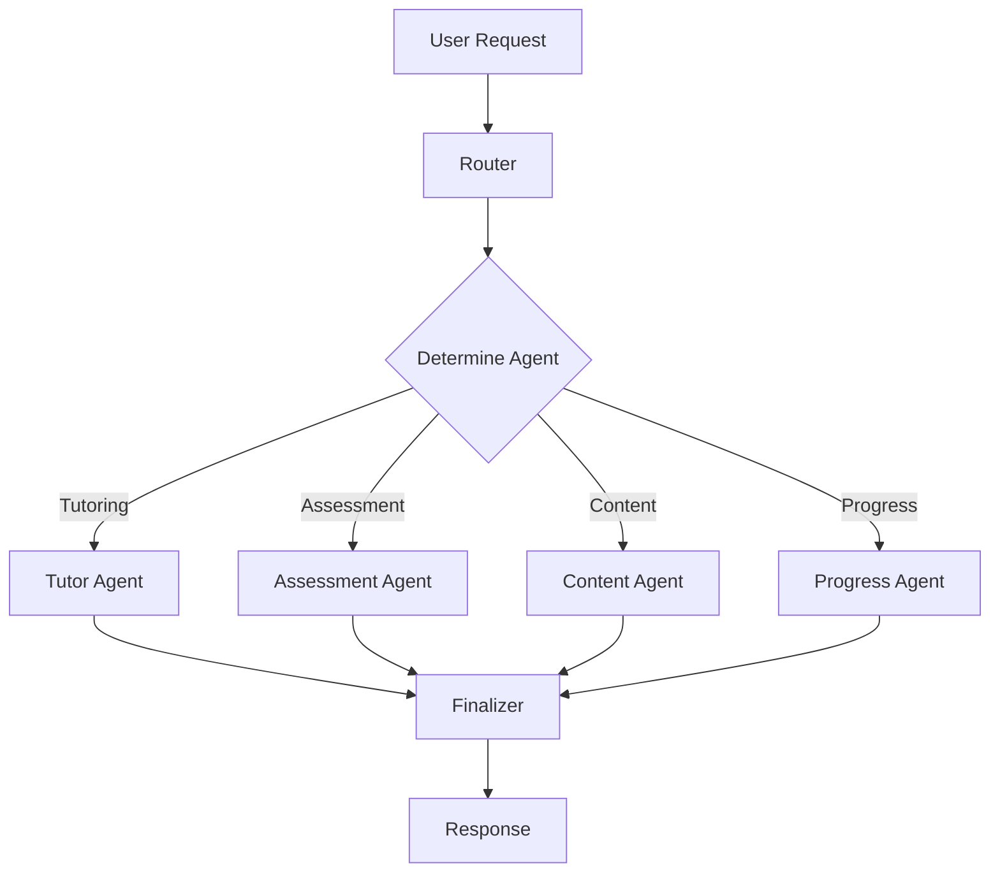

# ViperMind LangGraph Agent Architecture

## Overview

The ViperMind platform uses a sophisticated LangGraph-based agent architecture to provide intelligent tutoring, assessment generation, and personalized learning experiences. The system consists of four specialized agents orchestrated through a central workflow.

## Architecture Components

### 1. Agent Orchestrator (`vipermind_agent.py`)
- **LangGraph Workflow**: Central orchestrator using StateGraph
- **Request Routing**: Intelligent routing to appropriate specialized agents
- **State Management**: Shared state between all agents
- **Error Handling**: Comprehensive error handling and recovery

### 2. Specialized Agents

#### Tutor Agent (`tutor_agent.py`)
**Purpose**: Provides personalized explanations and learning guidance

**Capabilities**:
- Generate personalized lesson content
- Explain complex programming concepts
- Provide contextual hints for struggling students
- Adapt content based on user's learning style and progress

**Key Methods**:
- `_generate_lesson()`: Creates structured lesson content
- `_explain_concept()`: Provides personalized explanations
- `_provide_hint()`: Generates helpful hints
- `_personalize_content()`: Adapts content to user needs

#### Assessment Agent (`assessment_agent.py`)
**Purpose**: Creates and evaluates dynamic assessments

**Capabilities**:
- Generate topic quizzes (4 questions)
- Create section tests (15 questions) and level finals (30 questions)
- Evaluate assessment results with AI feedback
- Analyze performance patterns for difficulty adjustment

**Key Methods**:
- `_generate_quiz()`: Creates personalized quizzes
- `_generate_test()`: Creates comprehensive tests
- `_evaluate_assessment()`: Scores and provides feedback
- `_analyze_performance()`: Identifies learning patterns

#### Content Agent (`content_agent.py`)
**Purpose**: Generates dynamic educational content

**Capabilities**:
- Create code examples tailored to user interests
- Generate practice problems with varying difficulty
- Develop analogies and metaphors for complex concepts
- Create remedial content for struggling students

**Key Methods**:
- `_generate_examples()`: Creates personalized code examples
- `_create_practice_problems()`: Generates practice exercises
- `_generate_analogies()`: Creates helpful analogies
- `_generate_remedial_content()`: Creates targeted remedial content

#### Progress Agent (`progress_agent.py`)
**Purpose**: Analyzes learning patterns and tracks progress

**Capabilities**:
- Identify learning patterns and behaviors
- Predict learning outcomes and completion times
- Recommend optimal difficulty adjustments
- Generate personalized learning insights

**Key Methods**:
- `_analyze_patterns()`: Identifies learning patterns
- `_predict_outcomes()`: Forecasts learning success
- `_recommend_difficulty()`: Suggests difficulty adjustments
- `_generate_insights()`: Creates personalized insights

### 3. Agent Tools

#### Database Tool (`database_tool.py`)
**Purpose**: Provides database access for all agents

**Capabilities**:
- Retrieve user progress and curriculum data
- Update user progress and assessment results
- Access comprehensive learning analytics
- Manage user level and topic progression

#### OpenAI Tool (`openai_tool.py`)
**Purpose**: Integrates with OpenAI API for content generation

**Capabilities**:
- Generate educational content using GPT-4
- Create personalized explanations and examples
- Analyze code and provide feedback
- Generate dynamic questions and assessments

## Workflow Architecture



## API Integration

### RESTful Endpoints (`agents.py`)

- `POST /agents/lesson/generate` - Generate lesson content
- `POST /agents/quiz/generate` - Create personalized quizzes
- `POST /agents/assessment/evaluate` - Evaluate assessments
- `POST /agents/concept/explain` - Explain concepts
- `GET /agents/progress/analyze` - Analyze learning progress
- `POST /agents/hint/generate` - Generate helpful hints
- `POST /agents/invoke` - Direct agent invocation
- `GET /agents/status` - Agent system status

### Request/Response Models

All endpoints use Pydantic models for request validation and response serialization, ensuring type safety and proper data handling.

## Key Features

### 1. Personalization
- **User Context Awareness**: All agents consider user's current level, progress, and learning patterns
- **Adaptive Difficulty**: Content and assessments adapt based on user performance
- **Learning Style Detection**: Agents identify and adapt to individual learning preferences

### 2. Intelligence
- **GPT-4 Integration**: Advanced AI for content generation and analysis
- **Pattern Recognition**: Identifies learning patterns and predicts outcomes
- **Dynamic Content**: Real-time generation of personalized educational content

### 3. Scalability
- **Modular Architecture**: Each agent is independent and can be scaled separately
- **Stateless Design**: Agents can handle multiple concurrent requests
- **Database Integration**: Efficient data access and storage

### 4. Educational Quality
- **Structured Content**: All content follows educational best practices
- **Progressive Difficulty**: Content adapts to user's growing expertise
- **Comprehensive Feedback**: Detailed feedback on all assessments

## Implementation Status

✅ **Completed Components**:
- LangGraph workflow orchestration
- Four specialized agents (Tutor, Assessment, Content, Progress)
- Database and OpenAI tool integration
- RESTful API endpoints
- Comprehensive error handling
- State management and routing

⚠️ **Known Issues**:
- TensorFlow compatibility issue on some machines (AVX instruction set)
- Requires OpenAI API key for full functionality
- Some LangChain dependencies may need version compatibility fixes

## Usage Examples

### Generate Lesson Content
```python
from app.agents import generate_lesson

result = generate_lesson(
    user_id="user-123",
    topic_id="topic-456"
)
```

### Create Personalized Quiz
```python
from app.agents import create_quiz

quiz = create_quiz(
    user_id="user-123", 
    topic_id="topic-456"
)
```

### Analyze Learning Progress
```python
from app.agents import analyze_progress

analysis = analyze_progress(user_id="user-123")
```

## Future Enhancements

1. **Multi-modal Content**: Support for images, videos, and interactive content
2. **Advanced Analytics**: Machine learning models for deeper learning insights
3. **Collaborative Learning**: Agent support for peer learning and group activities
4. **Real-time Adaptation**: Live adjustment of content based on user interaction
5. **Voice Integration**: Support for voice-based interactions and explanations

## Testing

The agent system includes comprehensive testing:
- Unit tests for individual agent components
- Integration tests for workflow orchestration
- API endpoint testing
- Performance and load testing

Run tests with:
```bash
python test_agent_system.py
```

## Deployment Considerations

1. **Environment Variables**: Ensure OpenAI API key is properly configured
2. **Database Connection**: Verify database connectivity for all agents
3. **Memory Requirements**: LangGraph and AI models require adequate memory
4. **API Rate Limits**: Consider OpenAI API rate limits for production use
5. **Monitoring**: Implement logging and monitoring for agent performance

The ViperMind LangGraph agent architecture provides a robust, scalable, and intelligent foundation for AI-powered Python tutoring, with the flexibility to expand and enhance educational capabilities as needed.